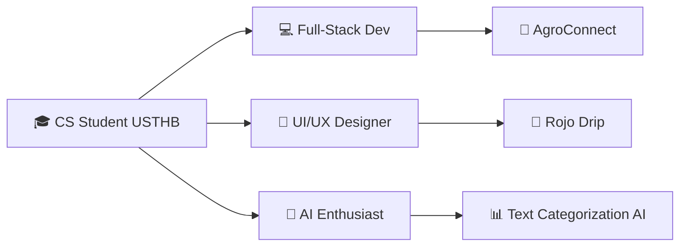

  

  

 

<!-- Profile Views & Badges -->

  
  
  
  
  

  

---

## 🚀 About Me

 <table> <tr> <td valign="top" width="50%"> <h3>🎯 What I'm Working On</h3> <ul> <li>🔭 <strong>Text Categorization AI</strong> - NLP classification project</li> <li>🌱 Learning <strong>Node.js, Go, Flutter</strong></li> <li>🤝 Looking to collaborate on <strong>LLM & NLP projects</strong></li> <li>🎨 Building <strong>Rojo Drip</strong> streetwear brand</li> <li>📝 Writing articles on tech & design</li> </ul>   <h3>📫 Connect With Me</h3> 
    
 </td> <td valign="top" width="50%"> <h3>💡 Fun Facts</h3> <ul> <li>🎨 I'm a <strong>Graphic & UI/UX Designer</strong> too</li> <li>📝 I regularly write articles on tech & design</li> <li>⚡ I build ideas into reality 💡🔥</li> <li>🇩🇿 Based in Algeria</li> <li>🎯 Always working on something new</li> </ul>   <h3>📄 Know More About Me</h3> 
  
 </td> </tr> </table> 

<h1>🛠️ Tech Stack</h1> 
<h2>💻 Programming Languages</h2>

        

###🌐 Web & Frameworks

        

###🗄️ Database & Tools

       

###🎨 Design & AI/ML

       

###📊 Skill Progress

Skill	Level	Progress
Java	⭐⭐⭐⭐⭐	https://progress-bar.dev/85
PHP/Laravel	⭐⭐⭐⭐⭐	https://progress-bar.dev/85
JavaScript/React	⭐⭐⭐⭐	https://progress-bar.dev/75
Python	⭐⭐⭐⭐	https://progress-bar.dev/70
C	⭐⭐⭐⭐	https://progress-bar.dev/70
UI/UX Design	⭐⭐⭐⭐	https://progress-bar.dev/75
Node.js	⭐⭐⭐	https://progress-bar.dev/50
Go	⭐⭐	https://progress-bar.dev/30
Flutter	⭐⭐	https://progress-bar.dev/35
NLP/AI	⭐⭐⭐	https://progress-bar.dev/60

###🚀 Featured Projects
###📊 Text Categorization AI
Tech: Python, NLTK, Scikit-learn, TensorFlow

Features: NLP preprocessing, TF-IDF, classification models

Status: 🔄 In Development

Goal: Build AI-powered text classification system

###🌾 AgroConnect (Startup)
Tech: Laravel, React, MySQL

Features: Equipment rental marketplace, real-time tracking

Status: 🚀 MVP Development

Impact: Helping farmers access agricultural equipment

###📁 Document Management System
Tech: Java Swing, Oracle DB

Features: File tracking, dossiers, secure authentication

Status: ✅ Completed

###💸 Invoice Generator
Tech: Java, iText PDF

Features: Automated PDF generation, multi-service invoicing

Status: ✅ Completed

👕 Rojo Drip (Streetwear Brand)
Role: Founder & Designer

Focus: Urban streetwear, graphic design

Status: 🎨 Active

###📈 GitHub Analytics

   

  

  

###🎯 Current Goals

Goal	Priority	Progress
Complete Text Categorization AI	🔥 High	https://progress-bar.dev/60
Launch AgroConnect	🔥 High	https://progress-bar.dev/40
Master Go Language	📚 Medium	https://progress-bar.dev/30
Master Flutter	📚 Medium	https://progress-bar.dev/35
Build LLM Application	🎯 High	https://progress-bar.dev/20

###🤝 Let's Collaborate!
##I'm always open to collaborating on:

🧠 LLM & NLP projects

🌱 AgriTech solutions

🎨 Creative tech projects

💡 Startup ideas

    

⚡ GitHub Trophies & Stats

  

🐍 Contribution Snake

  

💬 Random Dev Quote

  

  

 💻 Code. Design. Create. Repeat. 🔁 
 

